# MediCare 智慧医疗门诊管理系统 — 完整课程讲义

> **课程名称**：JavaFX 桌面应用开发与分层架构实战  
> **项目案例**：MediCare 智慧医疗门诊管理系统  
> **课时**：12 课时（每课时 45 分钟）  
> **授课对象**：有 Java SE 基础、希望掌握桌面应用与企业级架构的学员  
> **讲义版本**：v1.0（Markdown + Mermaid 图表版）

---

## 第 1 章：课程导入与项目概览

### 1.1 课程封面

**JavaFX 桌面应用开发与分层架构实战**

项目案例：MediCare 智慧医疗门诊管理系统

### 1.2 课程目标

通过 12 课时的学习，学员将能够：

- 掌握 JavaFX 21 桌面应用开发核心技术
- 理解并实践分层架构设计思想
- 熟练使用 Maven、Git 等企业级开发工具
- 独立完成基于脚手架的模块开发（DAO → Service → Controller → FXML）
- 掌握 HikariCP 连接池、DbUtils、事务控制等数据访问技术
- 具备团队协作与代码审查能力

### 1.3 项目业务模块

MediCare 是一个智慧医疗门诊管理系统，包含以下核心业务模块：

- **患者管理**：患者档案的建立、查询、编辑、删除
- **挂号预约**：科室选择、医生排班查看、预约登记
- **医生工作站**：接诊、病历书写、处方开具
- **药品库存**：药品入库、出库、库存预警
- **处方管理**：处方审核、发药、费用统计

### 1.4 技术栈全景

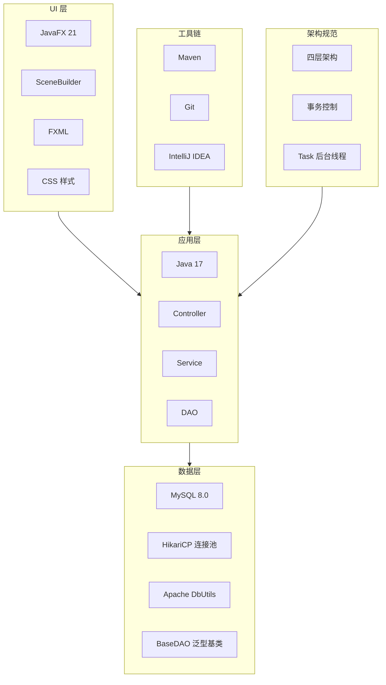

---

## 第 2 章：开发环境与工具链

### 2.1 环境安装清单

| 工具 | 版本 | 用途 |
|------|------|------|
| JDK | 17 LTS | Java 运行时与开发 |
| JavaFX | 21 | 桌面 UI 框架 |
| IntelliJ IDEA | 最新版 | 集成开发环境 |
| SceneBuilder | 21 | FXML 可视化设计工具 |
| Maven | 3.8+ | 项目构建与依赖管理 |
| MySQL | 8.0 | 关系型数据库 |
| Git | 最新版 | 版本控制 |

### 2.2 Maven 项目结构

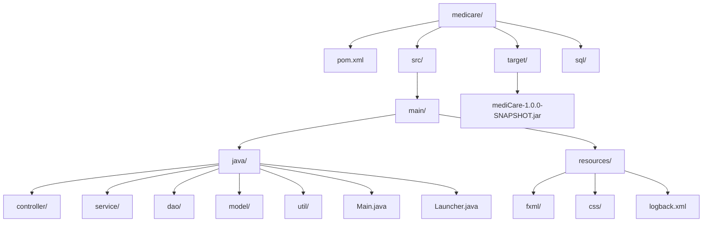

### 2.3 Maven 生命周期与打包

常用 Maven 命令：

```bash
# 清理并编译
mvn clean compile

# 运行测试
mvn test

# 打包（含 Shade 插件，生成 Fat JAR）
mvn clean package

# 运行项目
java -jar target/mediCare-1.0.0-SNAPSHOT.jar
```

Maven Shade 插件作用：将所有依赖打包到一个可执行的 JAR 文件中，方便分发和部署。

### 2.4 脚手架导入与运行

1. 打开 IntelliJ IDEA
2. 选择 `File → Open`，选中 `scaffold/` 目录
3. IDEA 自动识别 Maven 项目并下载依赖
4. 运行 `mvn clean package`
5. 执行 `java -jar target/mediCare-1.0.0-SNAPSHOT.jar`
6. 看到登录界面即表示运行成功

---

## 第 3 章：Git 协作规范

### 3.1 仓库初始化

```bash
# 老师创建中央仓库
git init --bare medicare.git

# 各小组克隆仓库
git clone <仓库地址>
```

### 3.2 分支策略

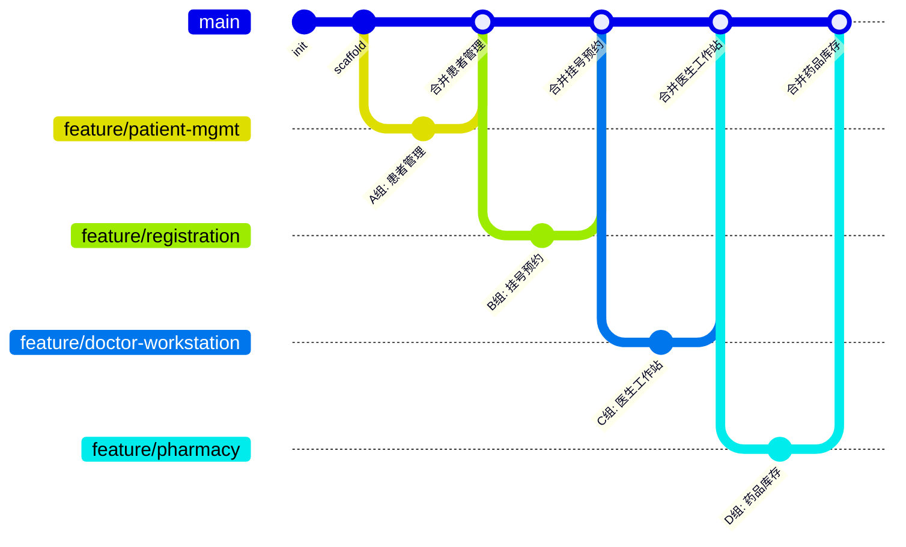

### 3.3 提交规范

```
feat: 新增患者管理模块 DAO 层
fix: 修复性别显示索引错误
refactor: 提取公共弹窗打开方法
docs: 更新接口文档
```

### 3.4 合并冲突处理

1. `git pull origin main` 获取最新代码
2. 手动编辑解决冲突文件
3. `git add .` 标记冲突已解决
4. `git commit` 提交解决后的代码

### 3.5 模块依赖关系

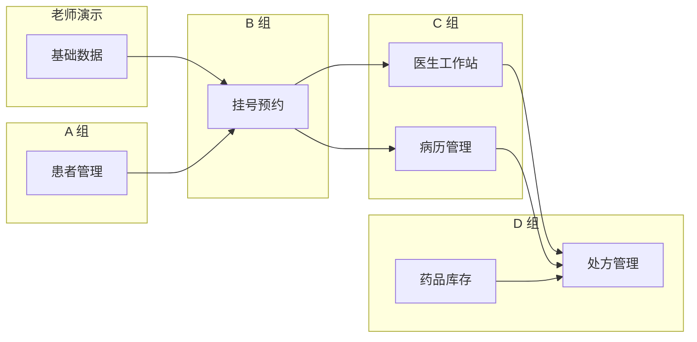

---

## 第 4 章：JavaFX 基础与 SceneBuilder

### 4.1 JavaFX 场景图层级

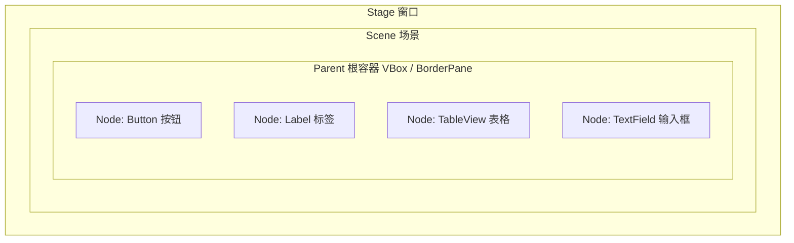

### 4.2 Application 生命周期

JavaFX 应用生命周期：`init()` → `start(Stage)` → `stop()`

- `init()`：初始化资源
- `start()`：创建主舞台和场景，程序入口
- `stop()`：释放资源

### 4.3 FXML 与 Controller 绑定

```mermaid
flowchart LR
    A["FXML 文件"] -->|fx:id| B["Controller 类"]
    A -->|onAction| C["事件处理方法"]
    B -->|@FXML 注解| D["成员变量注入"]
    E["FXMLLoader.load"] --> A
    E --> B
```

### 4.4 SceneBuilder 三区界面

SceneBuilder 界面分为三个主要区域：

1. **左侧：组件库**（Controls、Containers、Menu 等）
2. **中间：可视化设计画布**
3. **右侧：属性检查器**（Properties、Layout、Code）

### 4.5 参考案例：登录模块

登录模块是完整的参考案例，包含：

- `LoginView.fxml`：界面布局
- `LoginController.java`：业务逻辑
- 后台线程验证用户名密码
- 登录成功后的界面切换

---

## 第 5 章：JavaFX 布局详解

### 5.1 四大基础布局

| 布局 | 方向 | 核心属性 | 适用场景 |
|------|------|----------|----------|
| VBox | 垂直 | spacing, alignment, padding | 表单、列表 |
| HBox | 水平 | spacing, alignment, hgrow | 工具栏、按钮组 |
| BorderPane | 五区 | top/left/center/right/bottom | 主界面框架 |
| GridPane | 网格 | rowIndex, columnIndex | 复杂表单 |

### 5.2 BorderPane 五区布局

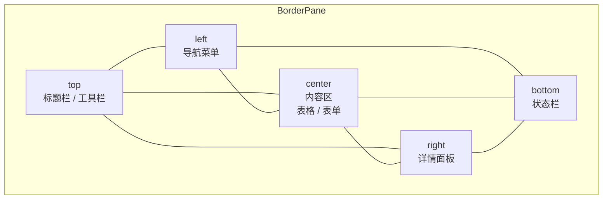

### 5.3 SplitPane / TabPane

- **SplitPane**：将界面分成可拖拽调整大小的区域，适合左右对照（如挂号预约、医生工作站）
- **TabPane**：通过 Tab 切换不同内容，适合分类管理（如基础数据的科室/医生/排班）

### 5.4 布局选择决策树

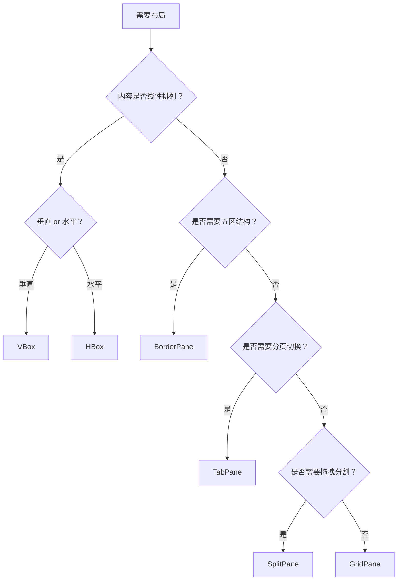

### 5.5 FXML 布局模板

项目提供四种布局模板：

| 模板 | 适用场景 | 使用模块 |
|------|----------|----------|
| `list-view-template.fxml` | 全宽表格 + 工具栏 | 患者、药品、病历 |
| `dialog-form-template.fxml` | 表单弹窗 | 患者编辑、药品编辑 |
| `split-pane-template.fxml` | 左右分割 | 挂号预约、医生工作站 |
| `tab-pane-template.fxml` | Tab 切换 | 基础数据 |

---

## 第 6 章：TableView 与数据绑定

### 6.1 TableView 泛型设计

```java
@FXML private TableView<Patient> tableView;
@FXML private TableColumn<Patient, Long> colId;
@FXML private TableColumn<Patient, String> colName;
@FXML private TableColumn<Patient, LocalDate> colBirthDate;
```

### 6.2 TableView 数据绑定流程

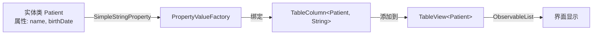

### 6.3 自定义 CellFactory

自定义 CellFactory 可用于：

- 状态颜色显示（在职绿色、停用灰色）
- 日期格式化
- 性别码值转换

示例代码：

```java
colStatus.setCellFactory(col -> new TableCell<>() {
    @Override
    protected void updateItem(Integer status, boolean empty) {
        super.updateItem(status, empty);
        if (empty || status == null) {
            setText(null);
            setStyle("");
        } else {
            setText(status == 1 ? "在职" : "停用");
            setStyle(status == 1 ? "-fx-text-fill: green;" : "-fx-text-fill: gray;");
        }
    }
});
```

### 6.4 Dialog 弹窗与表格联动

- 双击表格行打开编辑 Dialog
- 选中行填充右侧表单
- 保存后刷新表格数据

### 6.5 泛型类型匹配陷阱

❌ 错误：
```java
@FXML private TableColumn<Patient, String> colBirthDate;
```

✅ 正确：
```java
@FXML private TableColumn<Patient, LocalDate> colBirthDate;
```

TableColumn 的泛型第二个参数必须与实体属性类型一致。


---

## 第 7 章：多层架构思想

### 7.1 为什么需要分层架构

单层架构的问题：

- 业务逻辑与界面代码耦合
- 数据库访问代码散落在各处
- 难以单元测试
- 难以维护和扩展

### 7.2 四层架构职责边界

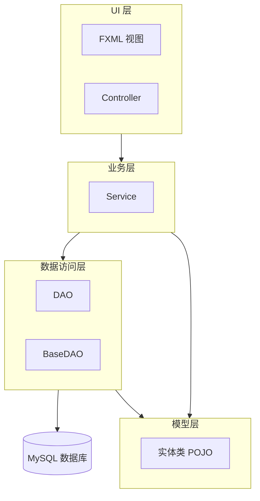

### 7.3 关键约束

**Controller 禁止直接调用 DAO。**

所有数据访问必须经过 Service 层，这是保证事务控制和业务规则统一的关键。

### 7.4 请求数据流

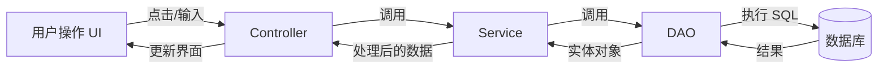

### 7.5 基础数据模块数据流走读

以科室管理为例：

1. 用户点击"科室管理"菜单 → Controller 接收事件
2. Controller 调用 `DepartmentService.listAll()`
3. Service 调用 `DepartmentDAO.findAll()`
4. DAO 执行 SQL，返回 `List<Department>`
5. Service 返回结果给 Controller
6. Controller 将数据设置到 TableView 中

---

## 第 8 章：事务控制与 Service 层

### 8.1 事务四步法

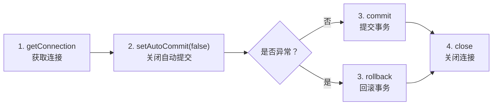

### 8.2 finally 关闭连接

无论事务成功还是失败，连接都必须在 `finally` 块中关闭，防止连接泄漏。

### 8.3 挂号事务核心案例

```java
Connection conn = null;
try {
    conn = registrationDAO.getConnection();
    conn.setAutoCommit(false);
    scheduleDAO.decrementRemain(reg.getScheduleId());
    Long id = registrationDAO.insert(conn, reg);
    registrationDAO.commit(conn);
    return id;
} catch (SQLException e) {
    registrationDAO.rollback(conn);
    throw e;
} finally {
    registrationDAO.closeConnection(conn);
}
```

### 8.4 取消挂号与出入库练习

- **取消挂号**：需要恢复号源余量、更新挂号状态
- **药品出入库**：需要更新库存数量、记录流水、更新处方状态

---

## 第 9 章：数据访问层深度讲解

### 9.1 HikariCP 连接池工作原理

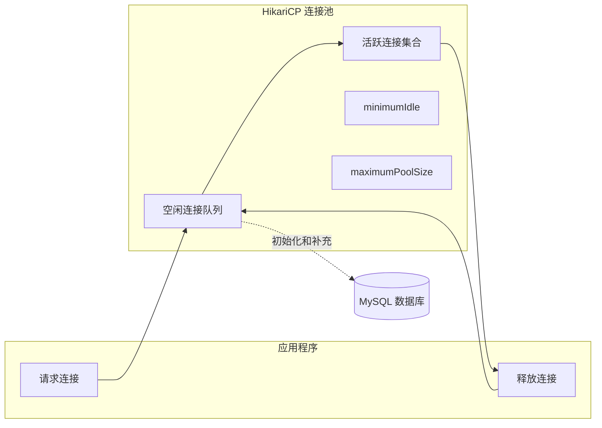

HikariCP 核心参数：

| 参数 | 说明 |
|------|------|
| jdbcUrl | 数据库连接地址 |
| username | 数据库用户名 |
| password | 数据库密码 |
| maximumPoolSize | 最大连接数 |
| minimumIdle | 最小空闲连接数 |
| connectionTimeout | 获取连接最大等待时间 |
| idleTimeout | 空闲连接超时时间 |

### 9.2 DbUtils 核心 Handler

| Handler | 用途 |
|---------|------|
| `BeanListHandler<T>` | 返回 List<T> |
| `BeanHandler<T>` | 返回单个 T |
| `ScalarHandler<T>` | 返回单个标量值 |

### 9.3 BaseDAO 设计与泛型 CRUD

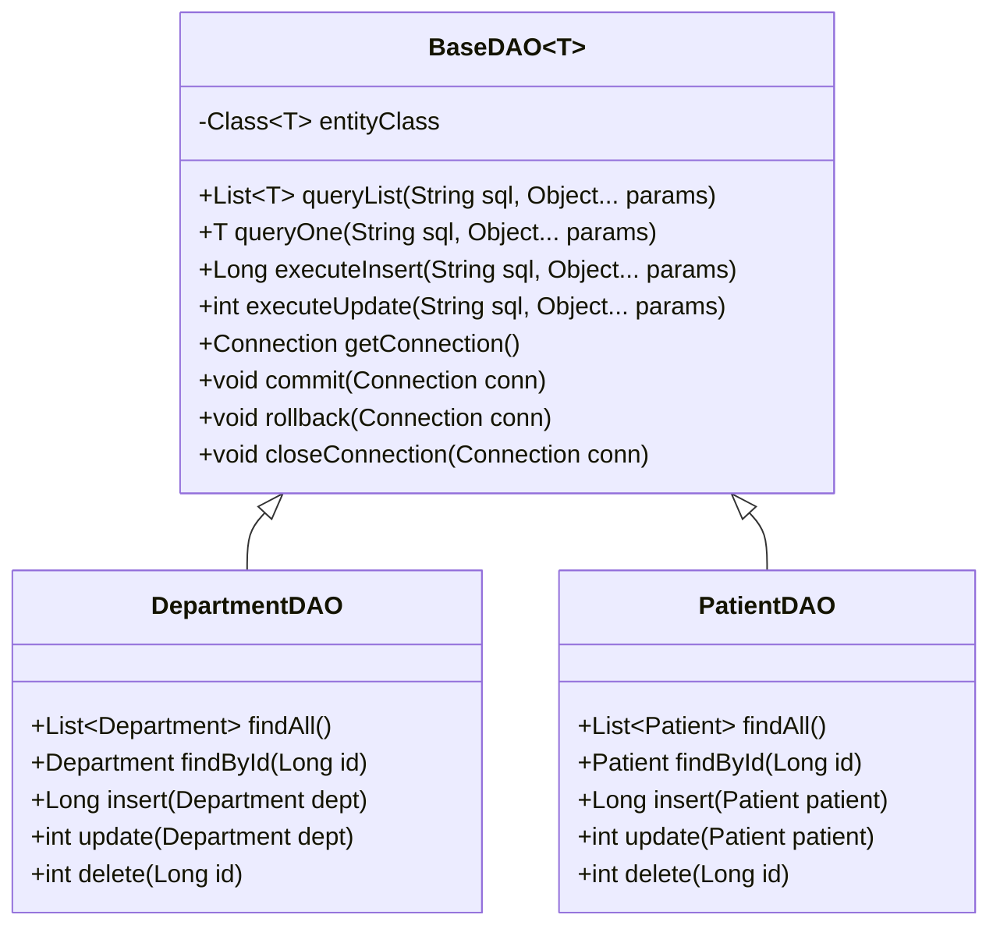

### 9.4 类型映射三剑客

| 问题 | 解决方案 | 代码位置 |
|------|----------|----------|
| 下划线 → 驼峰 | `GenerousBeanProcessor` | `BaseDAO` 构造参数 |
| `java.time` 不支持 | `JavaTimeBeanProcessor` | 覆写 `processColumn()` |
| `BIGINT UNSIGNED` → `BigInteger` | `executeInsert` 安全转换 | `((Number) result).longValue()` |
| `INT UNSIGNED` → `Long` | `Number` 接收 + `.intValue()` | `ScalarHandler` 场景 |

### 9.5 手写 DepartmentDAO

```java
public class DepartmentDAO extends BaseDAO<Department> {
    private static final String SQL_FIND_ALL = "SELECT * FROM department";
    private static final String SQL_INSERT = "INSERT INTO department(name, description) VALUES(?, ?)";
    private static final String SQL_UPDATE = "UPDATE department SET name=?, description=? WHERE id=?";
    private static final String SQL_DELETE = "DELETE FROM department WHERE id=?";

    public List<Department> findAll() throws SQLException {
        return queryList(SQL_FIND_ALL);
    }

    public Long insert(Department dept) throws SQLException {
        return executeInsert(SQL_INSERT, dept.getName(), dept.getDescription());
    }
}
```

---

## 第 10 章：后台线程与 UI 更新

### 10.1 JavaFX 单线程规则

JavaFX 所有 UI 更新必须在 JavaFX Application Thread 中执行。

在 UI 线程执行耗时操作会导致界面卡死。

### 10.2 JavaFX UI 线程与后台线程交互

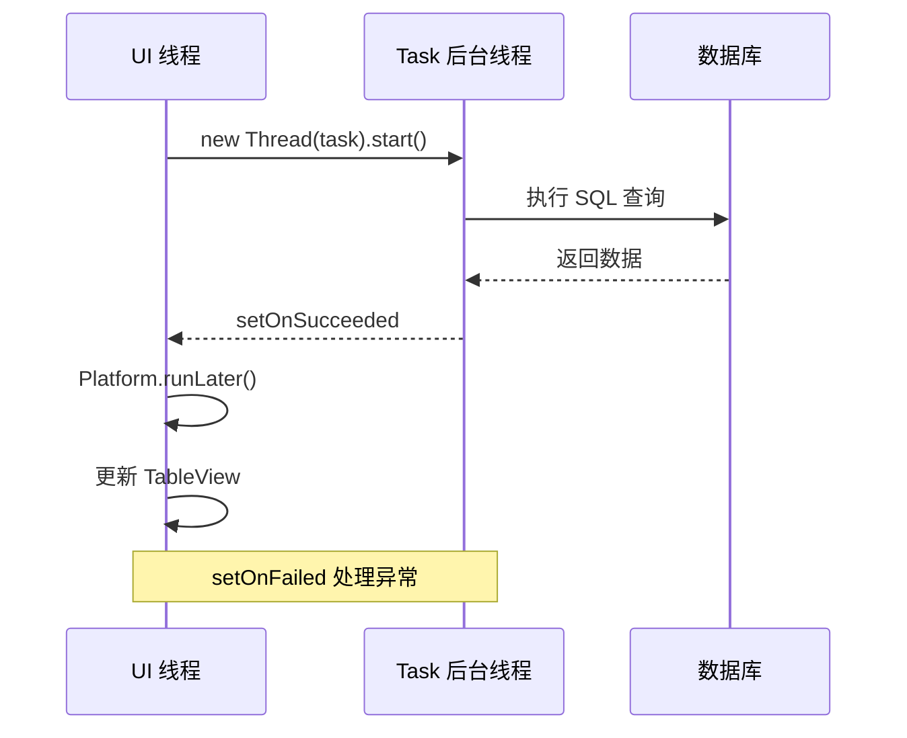

### 10.3 Task 标准模板

```java
Task<List<Patient>> task = new Task<>() {
    @Override
    protected List<Patient> call() throws Exception {
        return patientService.listAll(); // 后台线程
    }
};

task.setOnSucceeded(e -> Platform.runLater(() -> {
    patientList.setAll(task.getValue()); // UI 线程更新
}));

task.setOnFailed(e -> Platform.runLater(() -> {
    showAlert("加载失败: " + task.getException().getMessage());
}));

new Thread(task).start();
```

### 10.4 进度反馈

```java
task.updateProgress(current, total);
task.updateMessage("加载中...");
```

### 10.5 对比练习

- **错误做法**：在按钮事件处理中直接 `Thread.sleep(2000)`，界面卡死
- **正确做法**：使用 `Task` 在后台执行，通过 `Platform.runLater` 更新 UI

---

## 第 11 章：分组实战、联调与代码审查

### 11.1 分组开发流程

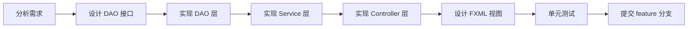

### 11.2 模块依赖与接口约定

开发前必须约定 DAO 和 Service 的 public 方法签名，以便独立开发和后期集成。

如果对方模块未完成，可以使用 mock 数据继续开发。

### 11.3 集成联调顺序

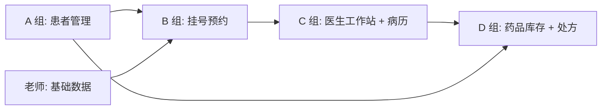

### 11.4 代码审查 Checklist

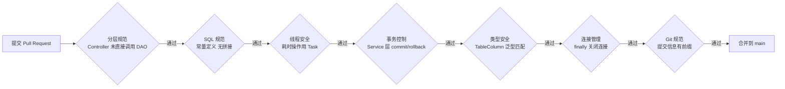

### 11.5 课程总结与知识地图

经过 12 课时的学习，学员已掌握：

- JavaFX 场景图与 FXML 绑定
- VBox / HBox / BorderPane / GridPane / TabPane / SplitPane 布局
- TableView 数据绑定与自定义 CellFactory
- Controller / Service / DAO / Model 四层架构
- 事务控制四步法
- HikariCP 连接池与 DbUtils
- Task 后台线程与 UI 更新
- Git 分支协作与代码审查

---

## 附录

### 附录 A：课程评分标准

| 评分项 | 分值 | 评分标准 |
|--------|------|----------|
| 功能完成度 | 40 | 需求清单完成比例 |
| 代码规范 | 25 | 分层、SQL、线程、事务 |
| 界面质量 | 15 | 布局合理、操作流畅、无卡顿 |
| 团队协作 | 10 | Git 使用、代码审查参与度 |
| 演示答辩 | 10 | 功能演示 + 问题回答 |

### 附录 B：课后作业

| 课时 | 作业内容 |
|------|----------|
| 1 | 完成环境搭建，加入 Git 仓库，创建 feature 分支 |
| 2 | 用 SceneBuilder 独立做一个"计算器"界面 |
| 3 | 用 GridPane 做一个"用户注册表单" |
| 4 | 用 TabPane 做一个"个人信息管理" |
| 5 | 跟着老师完成 DepartmentDAO，预习 PatientDAO |
| 6 | 完成基础数据模块的医生 Tab 和排班 Tab |
| 7 | 给基础数据模块添加 Task 模式的数据加载 |
| 8 | 画出自己负责模块的四层架构图 |
| 9 | 手写一个带事务的业务方法 |
| 10 | 独立手写 DepartmentDAO（不看参考） |
| 11 | 各组完成模块核心功能开发 |
| 12 | 完善模块、修复 Bug、准备演示 |

### 附录 C：常用命令速查

```bash
# Maven
mvn clean package
mvn clean compile

# Git
git checkout -b feature/xxx
git add .
git commit -m "feat: xxx"
git push origin feature/xxx

# JavaFX 运行
java -jar target/mediCare-1.0.0-SNAPSHOT.jar
```

---

*本讲义由 Kimi Code CLI 根据 MediCare 项目教案自动生成，图表使用 Mermaid 语法描述。*
